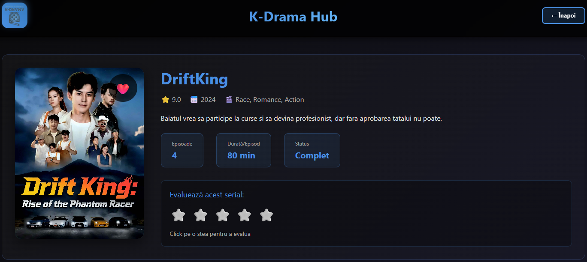
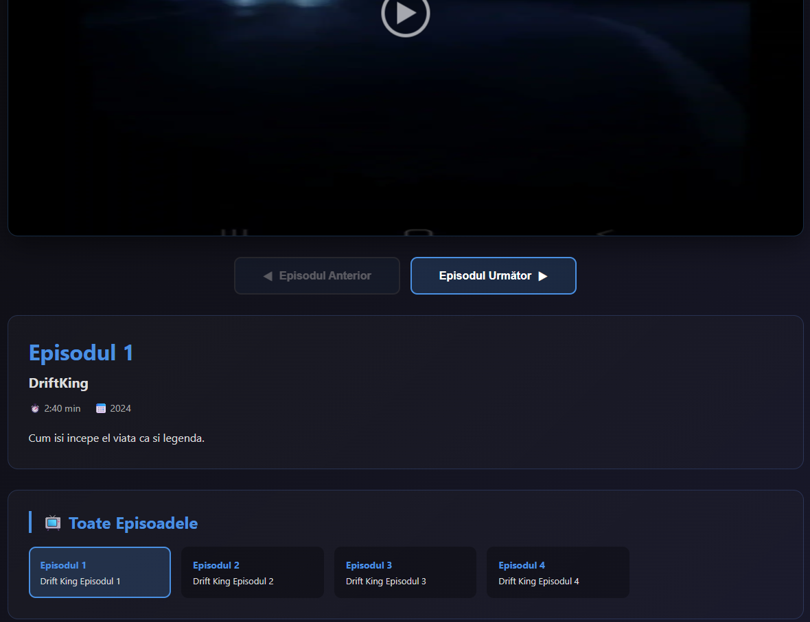

# 🎬 KDrama Hub

Site web modern pentru vizionarea și gestionarea serialelor K-Drama (seriale coreene). Creat cu HTML, CSS și JavaScript vanilla - fără framework-uri!

## 🌟 Demo Live

👉 **[Vezi Demo](https://LegionsX-Marius.github.io/kdrama)**

## ✨ Funcționalități Complete

- 🔍 **Căutare în timp real** - Găsește serialele instant
- ❤️ **Sistem de favorite** - Salvează serialele preferate cu notificări
- ⭐ **Rating cu stele** - Evaluează serialele (1-5 stele)
- 💬 **Sistem de comentarii** - Lasă păreri despre fiecare serial
- 🌓 **Dark/Light Mode** - Comută între teme
- 📱 **100% Responsive** - Perfect pe toate dispozitivele
- 🎯 **Filtre categorii** - Action, Romance, Thriller, Comedy, Fantasy
- 📺 **Video player integrat** - Suport YouTube, Vimeo, Google Drive
- 💾 **LocalStorage** - Toate preferințele sunt salvate local
- 🖼️ **Imagini personalizate** - Postere reale pentru fiecare serial
- 🎨 **Animații smooth** - Notificări și efecte moderne

## 🚀 Instalare Rapidă

### 1. Clonează repository-ul
```bash
git clone https://github.com/LegionsX-Marius/kdrama.git
cd kdrama
```

### 2. Creează folderul pentru imagini
```bash
mkdir img
```

### 3. Adaugă imagini
- Descarcă postere pentru seriale (300x400px sau 600x800px)
- Salvează în `img/` cu nume simple: `vincenzo.jpg`, `signal.jpg`

### 4. Deschide în browser
- Dublu-click pe `index.html` SAU
- Folosește un server local:

```bash
# Cu Python 3
python -m http.server 8000

# Cu Node.js
npx http-server
```

## 📁 Structura Proiectului

```
kdrama/
├── index.html          # Pagina principală
├── series.html         # Pagina serialului
├── episode.html        # Pagina episodului
├── data.js            # Baza de date
├── README.md          # Documentație
└── img/               # Imagini seriale
    ├── vincenzo.jpg
    ├── vagabond.jpg
    ├── crash-landing.jpg
    ├── signal.jpg
    ├── squid-game.jpg
    ├── goblin.jpg
    ├── business-proposal.jpg
    └── kingdom.jpg
```

## 🎬 Seriale Incluse

Site-ul vine cu 8 seriale pre-configurate:

| Serial | Categorie | Rating | Episoade |
|--------|-----------|--------|----------|
| Vincenzo | Action | 8.9 | 5 |
| Vagabond | Action | 8.2 | 4 |
| Crash Landing on You | Romance | 9.1 | 4 |
| Signal | Thriller | 9.2 | 3 |
| Squid Game | Thriller | 9.0 | 3 |
| Goblin | Romance | 9.0 | 3 |
| Business Proposal | Romance | 8.7 | 3 |
| Kingdom | Thriller | 8.4 | 3 |

## 📝 Cum să Adaugi un Serial Nou

Deschide `data.js` și adaugă:

```javascript
squid_game: {
    title: "Squid Game",
    image: "img/squid-game.jpg",  // Pune imaginea în img/
    icon: "🎯",  // Emoji fallback
    year: "2021",
    rating: "9.0",
    genre: "Thriller, Drama",
    description: "Sute de jucători participă la jocuri mortale...",
    category: "thriller",  // action, romance, thriller, comedy, fantasy
    episodes: [
        {
            title: "Red Light, Green Light",
            duration: "60 min",
            description: "Primul joc mortal începe...",
            videoUrl: "https://www.youtube.com/embed/VIDEO_ID"
        }
        // Mai multe episoade...
    ]
}
```

### Link-uri Video Suportate:
- **YouTube**: `https://www.youtube.com/embed/VIDEO_ID`
- **Vimeo**: `https://player.vimeo.com/video/VIDEO_ID`
- **Google Drive**: `https://drive.google.com/file/d/FILE_ID/preview`

## 🎨 Personalizare

### Schimbă Logo-ul

În fiecare fișier HTML, găsește:
```html
<div class="logo">K</div>
```

Schimbă cu:
- Text personalizat: `<div class="logo">KD</div>`
- Emoji: `<div class="logo">🎬</div>`
- Imagine: 
```html
<div class="logo">
    
</div>
```

### Schimbă Culorile

În CSS, caută și modifică:
```css
/* Culoare principală */
#4A90E2

/* Gradient albastru */
linear-gradient(135deg, #4A90E2, #357ABD)

/* Pentru verde */
linear-gradient(135deg, #56ab2f, #a8e063)

/* Pentru roșu */
linear-gradient(135deg, #ff416c, #ff4b2b)
```

## 🌐 Deploy pe GitHub Pages

### 1. Creează repository pe GitHub

### 2. Urcă fișierele
```bash
git init
git add .
git commit -m "K-Drama Hub- Complete Website"
git branch -M main
git remote add origin https://github.com/USERNAME/kdrama.git
git push -u origin main
```

### 3. Activează GitHub Pages
1. Mergi la `Settings` → `Pages`
2. Source: `Deploy from a branch`
3. Branch: `main` → `/root`
4. Click `Save`
5. Așteaptă 2-3 minute
6. Site live: `https://USERNAME.github.io/kdrama/`

## 🛠️ Tehnologii

- HTML5
- CSS3 (Animations, Flexbox, Grid, Gradients)
- Vanilla JavaScript (ES6+)
- LocalStorage API
- No frameworks - Pure code!

## 📱 Responsive Design

- **Desktop**: > 1400px (7 coloane)
- **Laptop**: 1000-1400px (5 coloane)
- **Tablet**: 768-1000px (4 coloane)
- **Mobile**: 500-768px (2-3 coloane)

## 💡 Caracteristici Tehnice

- ✅ SEO Optimizat (meta tags)
- ✅ Performance optimizat
- ✅ Cross-browser compatible
- ✅ Accessibility friendly
- ✅ No dependencies
- ✅ Fast loading
- ✅ Clean code structure

## 🐛 Troubleshooting

### Imaginile nu se încarcă?
- Verifică dacă imaginea există în `img/`
- Verifică calea în `data.js`: `image: "img/nume.jpg"`
- Numele trebuie să fie exact același (case-sensitive)

### Video-ul nu funcționează?
- Verifică formatul link-ului (trebuie să fie embed)
- YouTube: `youtube.com/embed/ID` nu `youtube.com/watch?v=ID`
- Verifică că video-ul permite embedding

### Dark mode nu se salvează?
- Verifică că browser-ul permite LocalStorage
- Nu folosi mode incognito

### Notificările nu apar?
- Verifică că JavaScript este activat
- Deschide Console (F12) pentru erori

## 🔄 Updates & Versiuni

**Versiunea Curentă**: v1.0 (Complete)

### v1.0 - Lansare Completă
- ✅ Toate funcționalitățile implementate
- ✅ Notificări pentru favorite
- ✅ Sistem complet de comentarii
- ✅ Rating cu stele
- ✅ Dark/Light mode
- ✅ Video player integrat
- ✅ 8 seriale pre-configurate

## 📄 Licență

MIT License - Folosește liber pentru proiecte personale sau comerciale.

## 🤝 Contribuții

Contribuțiile sunt binevenite!

1. Fork repository-ul
2. Creează un branch: `git checkout -b feature/NewFeature`
3. Commit: `git commit -m 'Add new feature'`
4. Push: `git push origin feature/NewFeature`
5. Deschide un Pull Request

## 📧 Contact & Support

- **GitHub**: [@LegionsX-Marius](https://github.com/LegionsX-Marius)
- **Email**: mariusbun@gmail.com

## 🙏 Credits

- Design inspirat de Netflix & Viki
- Emoji de la [Emojipedia](https://emojipedia.org/)
- Informații seriale de la [MyDramaList](https://mydramalist.com/)

## 📸 Screenshots

### Homepage


### Serial Page


### Episode Player


---

⭐ **Dacă îți place proiectul, lasă o stea pe GitHub!**


Made with ❤️ for K-Drama fans worldwide 🌍

